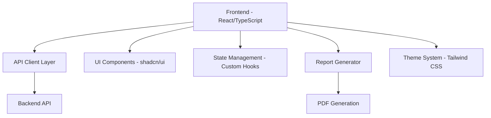

<div align="center">
  
  <h1>🎓 EDU Admin Suite</h1>
  <p><em>A comprehensive educational administration platform for managing academic operations</em></p>
  
  [](https://reactjs.org/)
  [](https://www.typescriptlang.org/)
  [](https://vitejs.dev/)
  [](https://tailwindcss.com/)
  
  [](https://github.com/Mohammad-Al-Bast/EDUadmin-frontend/issues)
  [](https://github.com/Mohammad-Al-Bast/EDUadmin-frontend/stargazers)
  [](#license)
</div>

---

## 📋 Table of Contents

- [🎯 Overview](#-overview)
- [✨ Features](#-features)
- [🏗️ Architecture](#️-architecture)
- [🛠️ Tech Stack](#️-tech-stack)
- [📋 Prerequisites](#-prerequisites)
- [🚀 Getting Started](#-getting-started)
- [📁 Project Structure](#-project-structure)
- [🔧 Configuration](#-configuration)
- [💻 Development](#-development)
- [🧪 Testing](#-testing)
- [📊 API Documentation](#-api-documentation)
- [🎨 UI Components](#-ui-components)
- [📱 Responsive Design](#-responsive-design)
- [🔐 Security](#-security)
- [🚀 Deployment](#-deployment)
- [🤝 Contributing](#-contributing)
- [📜 License](#-license)
- [👥 Team](#-team)
- [📞 Support](#-support)

---

## 🎯 Overview

**EDU Admin Suite** is a modern, comprehensive educational administration platform built for Lebanese International University. It streamlines academic operations through an intuitive web interface, providing tools for course management, student registration, grade processing, and administrative reporting.

### 🌟 Key Highlights

- **🎓 Academic Excellence**: Built specifically for higher education institutions
- **⚡ Modern Technology**: React 18 with TypeScript for type-safe development
- **🎨 Beautiful UI**: Professional design with shadcn/ui components
- **📱 Responsive**: Mobile-first approach ensuring accessibility across all devices
- **🔒 Secure**: Role-based access control and secure API integration
- **📊 Comprehensive Reporting**: Professional PDF generation and printable layouts

---

## ✨ Features

### 📚 Course Management

- ✅ **Complete CRUD Operations** - Create, read, update, and delete courses
- ✅ **Multi-Campus Support** - Manage courses across different campus locations
- ✅ **Section Management** - Handle multiple course sections efficiently
- ✅ **Semester Planning** - Organize courses by academic terms

### 👨‍🎓 Student Registration System

- ✅ **Registration Forms** - Streamlined course registration process
- ✅ **Form Validation** - Real-time validation with error handling
- ✅ **Submission Tracking** - Monitor registration status and history
- ✅ **Bulk Operations** - Process multiple registrations efficiently

### 📊 Grade Management

- ✅ **Grade Change Requests** - Submit and track grade modifications
- ✅ **Approval Workflow** - Multi-level approval process for grade changes
- ✅ **Grade History** - Complete audit trail of all grade modifications
- ✅ **Breakdown Analysis** - Detailed grade component analysis

### 📄 Report Generation

- ✅ **PDF Reports** - Professional, print-ready academic reports
- ✅ **Custom Templates** - Branded report templates with university branding
- ✅ **Real-time Data** - Live data integration for up-to-date reports
- ✅ **Export Options** - Multiple format support (PDF, Print)

### 🎨 User Experience

- ✅ **Dark/Light Mode** - Theme switching for user preference
- ✅ **Responsive Design** - Optimized for desktop, tablet, and mobile
- ✅ **Accessible UI** - WCAG compliant design patterns
- ✅ **Fast Navigation** - Command palette for quick actions

---

## 🏗️ Architecture



### 🎯 Design Principles

- **🔧 Component-Based Architecture** - Modular, reusable components
- **📱 Mobile-First Design** - Responsive across all screen sizes
- **♿ Accessibility** - WCAG 2.1 AA compliance
- **⚡ Performance** - Optimized bundle sizes and lazy loading
- **🔒 Security** - Secure API communication and data handling

---

## 🛠️ Tech Stack

### 🔧 Core Framework

| Technology     | Version | Purpose                                |
| -------------- | ------- | -------------------------------------- |
| **React**      | 18.x    | Modern UI framework with hooks         |
| **TypeScript** | 5.x     | Type-safe JavaScript development       |
| **Vite**       | 5.x     | Fast build tool and development server |

### 🎨 Styling & UI

| Technology       | Version | Purpose                         |
| ---------------- | ------- | ------------------------------- |
| **Tailwind CSS** | 3.x     | Utility-first CSS framework     |
| **shadcn/ui**    | Latest  | High-quality React components   |
| **Radix UI**     | Latest  | Accessible component primitives |
| **Lucide React** | Latest  | Beautiful icon library          |

### 🛠️ Development Tools

| Technology  | Version | Purpose                       |
| ----------- | ------- | ----------------------------- |
| **ESLint**  | Latest  | Code linting and quality      |
| **PostCSS** | Latest  | CSS processing                |
| **cmdk**    | Latest  | Command palette functionality |

---

## 📋 Prerequisites

### 💻 System Requirements

| Component   | Requirement | Recommended |
| ----------- | ----------- | ----------- |
| **Node.js** | v18.0+      | v20.0+      |
| **npm**     | v8.0+       | v9.0+       |
| **RAM**     | 4GB         | 8GB+        |
| **Storage** | 500MB       | 1GB+        |

### 🖥️ Operating System Support

- ✅ **Windows** 10/11
- ✅ **macOS** 10.15+
- ✅ **Linux** (Ubuntu 20.04+)

---

## 🚀 Getting Started

### 1️⃣ Clone Repository

```bash
git clone https://github.com/Mohammad-Al-Bast/EDUadmin-frontend.git
cd EDUadmin-frontend
```

### 2️⃣ Install Dependencies

```bash
# Using npm (recommended)
npm install

# Or using yarn
yarn install
```

### 3️⃣ Environment Setup

Create a `.env.local` file in the project root:

```env
# API Configuration
VITE_API_BASE_URL=http://localhost:3000/api
VITE_API_TIMEOUT=30000

# Application Settings
VITE_APP_NAME="EDU Admin Suite"
VITE_ORGANIZATION_NAME="Lebanese International University"
VITE_DEPARTMENT="Academic Affairs"

# Feature Flags
VITE_ENABLE_DEBUG=false
VITE_ENABLE_ANALYTICS=true
```

### 4️⃣ Start Development Server

```bash
npm run dev
```

🎉 **Success!** Open [http://localhost:5173](http://localhost:5173) in your browser.

---

## 📁 Project Structure

```
src/
├── 📁 api/                     # API client configuration
│   └── baseAPI.ts             # Axios-based API client
├── 📁 components/             # Reusable UI components
│   ├── 📁 pages/              # Page-specific components
│   │   └── 📁 Dashboard/      # Dashboard components
│   └── 📁 ui/                 # shadcn/ui components
├── 📁 hooks/                  # Custom React hooks
│   ├── 📁 courses/            # Course-related hooks
│   └── 📁 reports/            # Report generation hooks
├── 📁 lib/                    # Utility libraries
│   └── utils.ts               # Common utilities
├── 📁 services/               # API service layers
│   ├── 📁 courses/            # Course management services
│   └── 📁 change-grade/       # Grade change services
├── 📁 types/                  # TypeScript definitions
├── 📁 utils/                  # Utility functions
│   ├── reportGenerator.ts     # Report generation
│   └── pdfGenerator.ts        # PDF utilities
└── index.css                  # Global styles
```

---

## 🔧 Configuration

### ⚙️ Available Scripts

| Script          | Command              | Description              |
| --------------- | -------------------- | ------------------------ |
| **Development** | `npm run dev`        | Start development server |
| **Build**       | `npm run build`      | Create production build  |
| **Preview**     | `npm run preview`    | Preview production build |
| **Lint**        | `npm run lint`       | Run ESLint checks        |
| **Type Check**  | `npm run type-check` | TypeScript type checking |

### 🎛️ Environment Variables

| Variable                 | Default                             | Description       |
| ------------------------ | ----------------------------------- | ----------------- |
| `VITE_API_BASE_URL`      | `http://localhost:3000/api`         | Backend API URL   |
| `VITE_APP_NAME`          | `EDU Admin Suite`                   | Application name  |
| `VITE_ORGANIZATION_NAME` | `Lebanese International University` | Organization name |

---

## 💻 Development

### 🔧 Development Workflow

1. **Create Feature Branch**

   ```bash
   git checkout -b feature/your-feature-name
   ```

2. **Start Development Server**

   ```bash
   npm run dev
   ```

3. **Make Changes** - Follow existing patterns and conventions

4. **Test Your Changes** - Ensure functionality works across devices

5. **Commit Changes**
   ```bash
   git add .
   git commit -m "feat: add your feature description"
   ```

### 📝 Coding Standards

- ✅ **TypeScript** - Strict mode enabled
- ✅ **ESLint** - Follow configured rules
- ✅ **Component Structure** - Consistent file organization
- ✅ **Error Handling** - Proper error boundaries
- ✅ **Accessibility** - WCAG guidelines

### 🎯 Best Practices

- 🔧 **Use Custom Hooks** for reusable logic
- 🎨 **Follow Design System** components from shadcn/ui
- 🔒 **Implement Error Handling** for all API calls
- ⚡ **Optimize Performance** with React.memo and useMemo
- 📱 **Test Responsiveness** across different screen sizes

---

## 🧪 Testing

### 🔍 Testing Strategy

```bash
# Run all tests
npm run test

# Run tests in watch mode
npm run test:watch

# Generate coverage report
npm run test:coverage
```

### 📊 Testing Coverage

- ✅ **Unit Tests** - Component testing
- ✅ **Integration Tests** - API integration
- ✅ **E2E Tests** - User workflow testing
- ✅ **Accessibility Tests** - WCAG compliance

---

## 📊 API Documentation

### 🔗 API Integration

The application uses a centralized API client with the following features:

```typescript
// Example API service structure
export const coursesServices = {
  getAllCourses: () => Promise<Course[]>
  getCourseById: (id: number) => Promise<Course>
  createCourse: (data: CreateCourseRequest) => Promise<Course>
  updateCourse: (id: number, data: UpdateCourseRequest) => Promise<Course>
  deleteCourse: (id: number) => Promise<{ message: string }>
```
